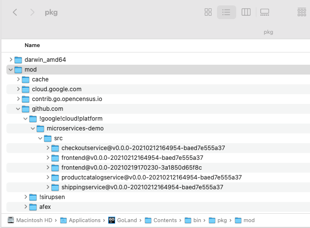
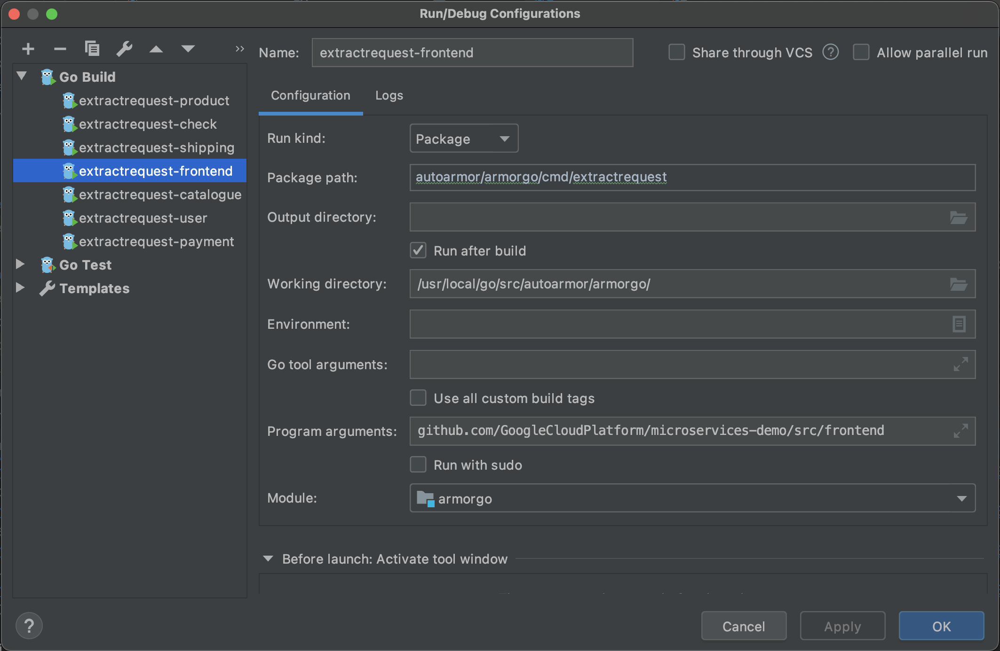

# AutoArmor for Go

ArmorGo是AutoArmor的静态分析引擎实现之一，提取由Go语言开发的微服务中的gRPC和TCP请求。

评估用例包括Online boutique应用的frontend, productcatalogservice, shippingservice, 和checkoutservice四个微服务，
以及Sock shop应用的payment, user, 和catalogue三个微服务。

## 运行方式

1. 将项目放置在GO_PATH中，即`$GO_ROOT/src/autoarmor/armorgo`

2. 将待分析的项目放置在GoLand的GO_PATH中的`pkg/mod`中，如在mac os上为`/Applications/GoLand.app/Contents/bin/pkg/mod/github.com/`

3. 修改`extractrequest.go`中的`productName`(line-24)为对应的项目名称，以获取`resources/deployment_files/`中存储的相应部署文件。

4. 配置编译运行，在`program argument`中填入待分析的项目的module路径，如：

5. 运行后，在`output`文件夹下生成相应的清单文件，描述各微服务发起的服务间请求。
